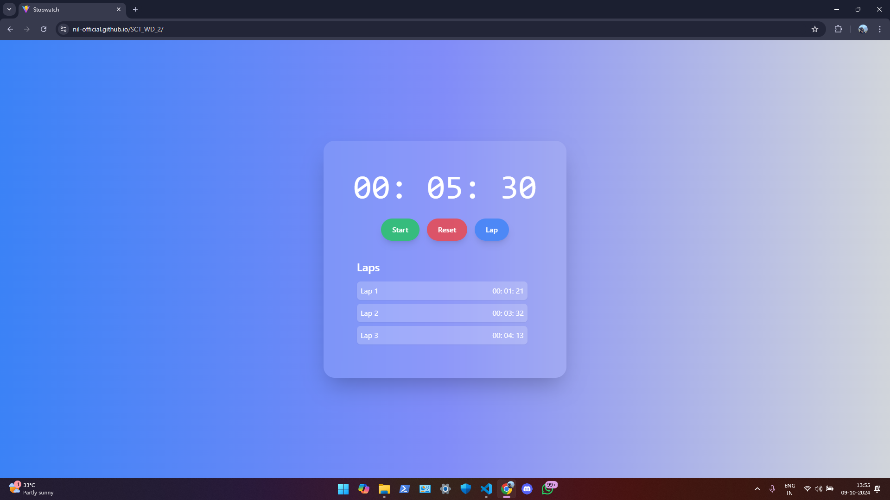

# Stopwatch Web Application



## Overview

This Stopwatch Web Application is a modern, interactive tool designed for accurately measuring and recording time intervals. Built with **React.js** and styled using **Tailwind CSS**, this application offers a user-friendly interface with essential features such as starting, pausing, resetting the stopwatch, and tracking lap times.

## Features

- **Responsive Design**: Adapts seamlessly across different devices for an optimal user experience.
- **Lap Time Recording**: Easily record multiple lap times, perfect for sports, cooking, studying, and more.
- **Stylish UI**: Includes a visually appealing background gradient and a sleek, transparent scrollbar.
- **User-Friendly Controls**: Simple and intuitive buttons for starting, pausing, resetting, and recording laps.

## Tech Stack

- **Frontend**: React.js
- **Styling**: Tailwind CSS

## Live Demo

You can view the live demo of the application here: [Stopwatch Web App](https://nil-official.github.io/SCT_WD_2/)

## Installation

To get started with this project, follow these steps:

1. Clone the repository:
   ```bash
   git clone https://github.com/nil-official/SCT_WD_2.git
   cd SCT_WD_2
